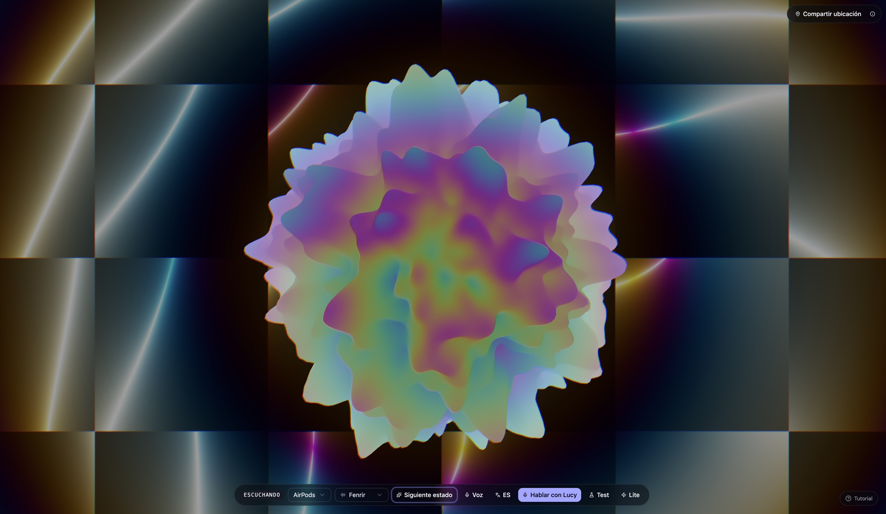

# Apophasis

> A reverse search engine for **anything you cannot fully describe** —
> a song you half-remember, a book whose title you forgot, a place from a
> friend's story, a product you saw once. You talk to **Lucy**, a voice
> agent powered by Gemini Live; she listens, builds live UI panels you can
> tune in real time, and converges on the result.



This repo is the demo SPA + thin Bun proxy that runs both locally and on
GCP Cloud Run.

**Live demo:** [https://lucy-blob-nvfgf6doka-uc.a.run.app/](https://lucy-blob-nvfgf6doka-uc.a.run.app/)

**Pitch deck (PDF):** [docs/presentation/presentation.pdf](docs/presentation/presentation.pdf) — the deck we ran at the AI Tinkerers Vibe Coding hackathon.

---

## Table of contents

1. [What it does](#what-it-does)
2. [Tech stack](#tech-stack)
3. [Architecture](#architecture)
4. [Quick start](#quick-start)
5. [Environment variables](#environment-variables)
6. [Available scripts](#available-scripts)
7. [Project layout](#project-layout)
8. [Search tools](#search-tools)
9. [Testing](#testing)
10. [Deploying](#deploying)
11. [Adding a new search provider](#adding-a-new-search-provider)

---

## What it does

- **Voice in, voice out.** A WebSocket to the Gemini Live API streams
  audio both ways. Server-side VAD lets Lucy interrupt and be interrupted
  naturally.
- **Generative UI.** Lucy doesn't just talk — she calls
  `render_surface()` to draw cards, sliders, choice pickers, and text
  fields on screen via [A2UI](https://github.com/a2ui/a2ui) so you can
  tune the search visually instead of repeating yourself out loud.
- **Domain-routed search.** Per turn Lucy picks the most specific search
  tool for what you said: songs → iTunes, videos → YouTube, books →
  Google Books, places → Google Maps, products → Google Shopping,
  anything else → multi-source web (Brave + Tavily + Exa, fanned out in
  parallel).
- **Three-dimensional blob.** A `react-three-fiber` scene reacts to
  conversation phase (idle / listening / thinking / asking / result).
  The visual is the indicator; controls are minimal by design.

---

## Tech stack

| Concern              | Choice                                                    |
|----------------------|-----------------------------------------------------------|
| Bundler / dev server | Vite 8                                                    |
| UI framework         | React 19 + Tailwind 4 (shadcn/ui conventions, lucide icons) |
| State                | Zustand                                                   |
| 3D / shader          | three.js + @react-three/fiber + drei + postprocessing     |
| Live UI surfaces     | @a2ui/react v0.9                                          |
| Voice / LLM          | @google/genai (Gemini Live API, `gemini-3.1-flash-live-preview`) |
| Server runtime       | Bun (`server/index.ts`) — proxy + static file server      |
| Linter / formatter   | Biome                                                     |
| Tests                | Vitest (jsdom for unit, node for live tool tests)         |
| Deploy target        | GCP Cloud Run (single service) + Terraform                |

---

## Architecture


Source for the diagram lives at [docs/architecture-logical.py](docs/architecture-logical.py) — uses the [`diagrams`](https://diagrams.mingrammer.com/) Python package with the official GCP icon set, rendered via Graphviz.

Browser providers for `search_music` (iTunes) and `search_video`
(YouTube Data API) call upstream directly because they're CORS-open and
either unauthenticated or use the `VITE_YOUTUBE_API_KEY`. All other
provider keys live server-side; the browser hits `/api/search/<x>`.

---

## Quick start

### Prerequisites

- **[Bun](https://bun.sh) 1.2+** — runs the dev server, the test runner,
  and the production server. (`curl -fsSL https://bun.sh/install | bash`)
- A **Gemini API key** from
  [https://aistudio.google.com/apikey](https://aistudio.google.com/apikey).
  Free tier is enough to try the demo.
- (Optional, for richer search results) keys from Brave, Tavily, Exa,
  SerpApi — see [Environment variables](#environment-variables).

### Install + run

```bash
git clone <this-repo>
cd lucy-blob

bun install

cp .env.example .env.local
$EDITOR .env.local        # paste at minimum VITE_GEMINI_API_KEY

bun run dev:all           # starts Vite (port 5173) + Bun server (port 8787)
```

Open http://localhost:5173, click the mic button, and talk. Lucy will
ask for microphone permission on first use.

If you only want the SPA without server endpoints, `bun run dev` works
on its own — but `/api/log`, `/api/gemini-token`, and `/api/search/*`
will all return `connection refused`.

### Mic + browser notes

- Chrome/Edge work best. Safari occasionally rejects the WebSocket
  upgrade on `localhost`; use `http://127.0.0.1:5173` if so.
- The page must stay focused while Lucy is speaking — most browsers
  pause Web Audio in background tabs.

---

## Environment variables

Copy `.env.example` to `.env.local` and fill in what you need. The app
runs with **just the Gemini key**; everything else gracefully degrades.

### Required

| Variable                | Where to get it                                        | Notes |
|-------------------------|--------------------------------------------------------|-------|
| `VITE_GEMINI_API_KEY`   | https://aistudio.google.com/apikey                     | Ships to the browser in dev. **Do not deploy publicly without proxying through `/api/gemini-token`.** |

### Optional (browser-direct, currently)

| Variable                | Provider          | Used by      |
|-------------------------|-------------------|--------------|
| `VITE_YOUTUBE_API_KEY`  | YouTube Data v3   | `search_video` |

### Optional (server-side proxy)

These never reach the browser; the Bun proxy reads them and exposes
results via `/api/search/<provider>`. **Do not add a `VITE_` prefix.**

| Variable          | Provider | Used by                         |
|-------------------|----------|---------------------------------|
| `BRAVE_API_KEY`   | [Brave Search](https://api.search.brave.com/app/keys) | `search_web` (web lane)        |
| `TAVILY_API_KEY`  | [Tavily](https://app.tavily.com/home)                  | `search_web` (answer lane)     |
| `EXA_API_KEY`     | [Exa](https://dashboard.exa.ai/api-keys)               | `search_web` (semantic lane)   |
| `SERPAPI_KEY`     | [SerpApi](https://serpapi.com/manage-api-key)          | `search_books` / `search_places` / `search_products` |

`search_web` works with **any one** of Brave / Tavily / Exa configured;
results just have less diversity when only one lane fires.

---

## Available scripts

| Command                | What it does                                                  |
|------------------------|---------------------------------------------------------------|
| `bun run dev`          | Vite SPA only on port 5173                                    |
| `bun run server`       | Bun proxy only on port 8787 (set `PORT` to override)          |
| `bun run dev:all`      | Both, in parallel — the usual local-dev command               |
| `bun run build`        | `tsc -b` then `vite build` → `dist/`                          |
| `bun run preview`      | Serve `dist/` via Vite preview                                |
| `bun run lint`         | Biome check on `src/`                                         |
| `bun run lint:fix`     | Biome auto-fix                                                |
| `bun run format`       | Biome format-only                                             |
| `bun run test`         | Vitest unit tests (jsdom, network-free)                       |
| `bun run test:tools`   | Live tool-validation suite — real upstream calls (~22s, billed) |
| `bun run test:ui`      | Vitest with the web UI                                        |
| `bun run validate:ui`  | Headless Gemini Live runner that checks the system prompt still produces well-formed A2UI surfaces |

---

## Project layout

```
.
├── server/                       Bun server (proxy + static)
│   ├── index.ts                  Routes + CORS + rate limit
│   ├── geminiToken.ts            Mints short-lived Live API tokens
│   ├── logStore.ts               JSONL log writer (local file or GCS)
│   ├── searchProxy.ts            /api/search/* router
│   ├── searchCache.ts            10-min TTL LRU
│   └── searchRateLimit.ts        Per-IP sliding window
│
├── src/
│   ├── App.tsx                   Mounts the scene + UI panels
│   ├── main.tsx                  React entry
│   ├── globals.css / index.css   Tailwind + design tokens
│   │
│   ├── audio/                    Web Audio recorder + streamer
│   │   └── worklets/             AudioWorklet for low-latency capture
│   │
│   ├── gemini/
│   │   ├── liveSession.ts        Live API wrapper — system prompts, tool config, audio routing
│   │   ├── tools.ts              UI tool declarations + provider tools merged
│   │   └── credential.ts         Picks ephemeral token or local key
│   │
│   ├── hooks/
│   │   └── useVoiceSession.ts    Top-level glue — wires recorder, session, A2UI, gallery
│   │
│   ├── a2ui/
│   │   ├── catalog/              Renderers for A2UI components (Button, Slider, etc.)
│   │   ├── processor.ts          A2UI MessageProcessor + action dispatch
│   │   └── demoSurface.ts        Bootstrap surface used in the empty state
│   │
│   ├── scene/                    three.js blob + shader + backdrop
│   │   └── shaders/              GLSL fragment + vertex programs
│   │
│   ├── lib/
│   │   ├── search/
│   │   │   ├── types.ts          SearchResult / SearchProvider types
│   │   │   ├── schemas.ts        Zod contract (used by tests)
│   │   │   ├── registry.ts       Array of all enabled providers
│   │   │   └── providers/        One file per Gemini search tool
│   │   ├── messages.ts           i18n strings (EN/ES)
│   │   ├── searchMusic.ts        iTunes adapter
│   │   └── sessionLogger.ts      Client → /api/log
│   │
│   ├── store/
│   │   └── index.ts              Zustand: phase, transcripts, surfaces, results
│   │
│   ├── ui/                       Top-level UI panels (Controls, Sidebar, ResultGallery, …)
│   └── components/ui/            shadcn primitives
│
├── tests/
│   ├── README.md                 How the live tool suite works
│   ├── helpers/                  proxy boot, env loader, shared assertions
│   └── tools/                    One real-call test file per Gemini tool
│
├── scripts/
│   └── validate-ui/              Headless Gemini Live runner + scenarios
│
├── infra/                        Terraform — Cloud Run + AR + Secret Manager + GCS
│   └── README.md                 GCP deploy instructions
│
├── Dockerfile                    Two-stage: Vite build → Bun runtime
├── .env.example                  All env vars documented
└── package.json
```

---

## Search tools

Six tools are exposed to Gemini today. Each one is a single file under
`src/lib/search/providers/` plus an entry in `registry.ts`. The
`useVoiceSession` hook dispatches generically by name — adding a tool
requires zero changes to the hook.

| Tool              | Backend                  | Where the call originates |
|-------------------|--------------------------|---------------------------|
| `search_music`    | iTunes Search API        | Browser direct (CORS-open)|
| `search_video`    | YouTube Data API v3      | Browser direct (`VITE_YOUTUBE_API_KEY`) |
| `search_books`    | SerpApi (`engine=google&udm=36`) | Bun proxy (`SERPAPI_KEY`) |
| `search_places`   | SerpApi (`engine=google_maps`)   | Bun proxy (`SERPAPI_KEY`) |
| `search_products` | SerpApi (`engine=google_shopping`)| Bun proxy (`SERPAPI_KEY`) |
| `search_web`      | Brave + Tavily + Exa fan-out (parallel, deduped, with Tavily's synthesised answer surfaced) | Bun proxy |

All providers normalise their upstream's response into the shared
`SearchResult` shape (`src/lib/search/types.ts`) so the gallery can
render any kind without per-provider code paths.

---

## Testing

Two suites with different cost / coverage trade-offs:

```bash
bun run test          # unit tests, jsdom, no network — fast
bun run test:tools    # live tool suite, real upstream calls (~22s)
```

The **live suite** (`tests/tools/*.test.ts`) is the one that validates
each search tool end-to-end. Per tool it asserts:

1. The tool is registered with the right name + kind.
2. The handler accepts the args Gemini emits (input contract).
3. A real call returns schema-valid results (`SearchResultSchema.safeParse`).
4. The top result is "Lucy-ready" (title without raw HTML, actionable
   via URL or preview, description ≤ 500 chars).
5. Edge cases — empty query returns `[]`, `max_results` cap respected.

Plus one tool-specific assertion that captures **what makes that tool
useful** (e.g., `search_products` top result must have a price + a
store; `search_web` must show provenance from all three lanes; etc.).

If a key is missing the matching tests skip with a clear message.
See [tests/README.md](tests/README.md) for the extension checklist.

For a hands-on, **Spanish-language testing & demo guide** — voice
prompts that trigger each tool, what to look for in the UI, common
failure modes — see [docs/GUIA_PRUEBAS.es.md](docs/GUIA_PRUEBAS.es.md).

The headless `validate:ui` runner (`bun run validate:ui scripts/validate-ui/scenarios/*.json`)
is a separate eval that boots a text-mode Gemini session and checks
that the system prompt still produces well-formed A2UI surfaces — useful
when editing prompts or tool declarations.

---

## Deploying

The current deployment lives at
[https://lucy-blob-nvfgf6doka-uc.a.run.app/](https://lucy-blob-nvfgf6doka-uc.a.run.app/) —
a single Cloud Run service serving both the SPA and the `/api/*` routes.
Full walkthrough — gcloud bootstrap, Terraform apply, Docker build/push,
custom domain, costs, teardown — lives in
[**infra/README.md**](infra/README.md).

Short version once configured:

```bash
IMAGE=$(cd infra && terraform output -raw artifact_registry_repo)/lucy-blob:$(date +%Y%m%d-%H%M)
docker build --platform=linux/amd64 -t "$IMAGE" .
docker push "$IMAGE"
( cd infra && terraform apply -var image="$IMAGE" )
```

---

## Adding a new search provider

The shape is intentionally small so a new domain is ~50 lines plus a
test file:

1. **Drop a new file** under `src/lib/search/providers/<name>.ts`
   exporting a `SearchProvider`. Copy any existing one as a template.
2. **Register** it in `src/lib/search/registry.ts`.
3. **Server-side?** If the upstream key cannot ship to the browser (the
   default for paid APIs), add a route in `server/searchProxy.ts` and
   route the browser provider's `fetch` at `/api/search/<x>` via
   `proxyClient.ts`.
4. **Update Lucy's prompt** in `src/gemini/liveSession.ts` (EN + ES)
   with one line describing the tool and a one-line routing rule so
   she knows when to pick it.
5. **Add a test** in `tests/tools/search_<name>.test.ts` — copy any
   existing one. Pick a stable known-good input and the one tool-
   specific assertion that defines "useful for Lucy" (a price facet, an
   audio preview, a YouTube URL — whatever this domain demands).
6. `bun run test:tools` to verify, then `bun run lint` and
   `bun run build`.

That's the whole loop. The dispatcher in `useVoiceSession.ts` is
generic; the gallery is generic; the schema rejects drift; the prompt
and the test capture the new contract.

---

## License

Private demo — no public license at this time.
